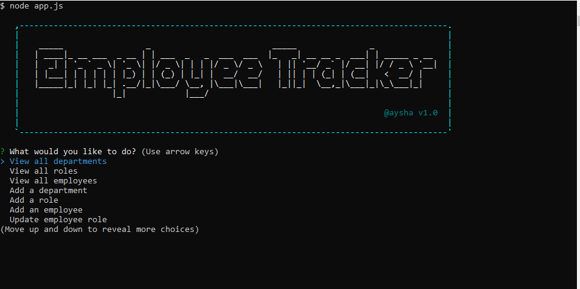

# Employee-Management-System

## Employee Tracker is a node.js application that uses MySQL Workbench

- [Description](#description)
- [Connect to Database](#connect-to-database )
- [Installation](#installation)
- [License](#license)
- [Technologies Used](#technologies-used)
- [Questions](#questions)

## Description
Employee Tracker is a node.js application that uses MySQL Workbench. This application manages all employees working in a company with different departments and roles. This app can add, view, and update information. This app was developed using Node, Inquirer prompts, and MySQL.

## Connect to Database 

```javascript
const connection = mysql.createConnection({
	host: 'localhost',
	port: 3306,
	user: 'root',
	password: 'your password',
	database:  'employees_DB'
});

```

## Installation
```
npm install
   mysql
   inquirer
   figlet
   console-table-printer
   asciiart-logo

```

## License
[](https://opensource.org/licenses/MIT)

### Screenshot - Showing Node command line interface
- View departments, roles and employees.
- Add departments, roles and employees.





## Technologies Used
The following technologies and tools were used:
- JavaScript
- Node.js
- MySQL Workbench

## Questions
For any other questions, please send me an email at: isasanyang1986@yahoo.co.uk.
